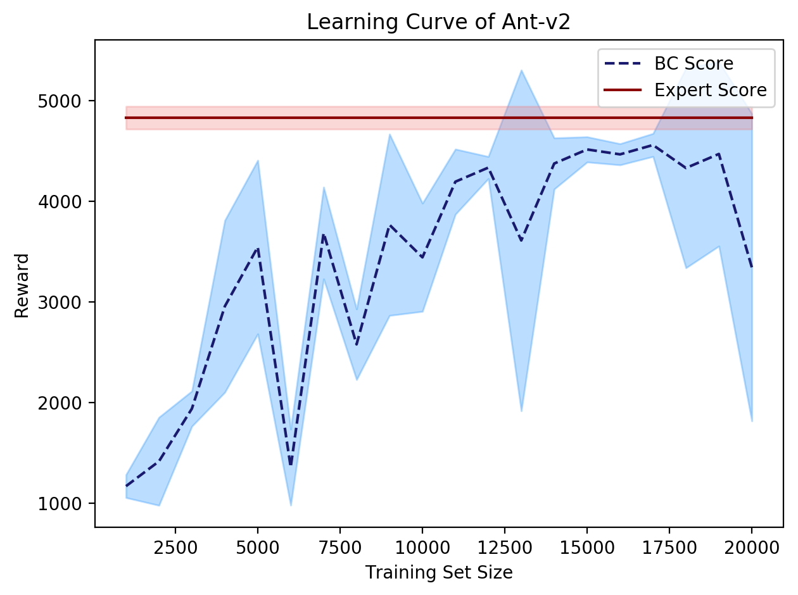

# CS294-112 HW 1: Imitation Learning

Dependencies:
 * Python **3.5**
 * Numpy version **1.14.5**
 * TensorFlow version **1.10.5**
 * MuJoCo version **1.50** and mujoco-py **1.50.1.56**
 * OpenAI Gym version **0.10.5**

Once Python **3.5** is installed, you can install the remaining dependencies using `pip install -r requirements.txt`.

**Note**: MuJoCo versions until 1.5 do not support NVMe disks therefore won't be compatible with recent Mac machines.

**Note**: MuJoCo requires activation key.

The only file that you need to look at is `run_expert.py`, which is code to load up an expert policy, run a specified number of roll-outs, and save out data.

In `experts/`, the provided expert policies are:
* Ant-v2.pkl
* HalfCheetah-v2.pkl
* Hopper-v2.pkl
* Humanoid-v2.pkl
* Reacher-v2.pkl
* Walker2d-v2.pkl

The name of the pickle file corresponds to the name of the gym environment.


### Getting expert data
To generate expert data for training run:

```bash
bash get_expert_data.bash
```
The script uses `run_expert.py` to generate 20 roll-outs (each with 1000 iteratiors, totaling 20K examples) of experts policies of aforementioned tasks. The data is saved to `experts_data/` in pickle files.

## Section 2 - Behavioral Cloning
### 2.1 Implementing behavioral cloning
To train the supervised model for behavioral cloning run:

```bash
bash fit_bc_model.bash
```
The script uses `run_bc.py` to train a set of neural network based on the gathered expert data. The standard training setting uses 100-100-100 layer structure with 256 batch size and total 100 epochs for training. The resulting models are saved to `models/` as h5 files and corresponding fitting results with graphs in `results/bc/`.

### 2.2 Testing behavioral cloning
To test the performance of the BC models run:

```bash
bash run_bc_comparison.bash
```
The script uses `run_bc_eval.py` to evaluate the performance of behavioral cloning policies for all the specified environments. The results are saved to `results/bc_evaluation/` as pickle files.

To plot the results in table, one can tabulating function `plot_bc_results` from `run_bc_eval.py` (requires pytablewriter package):

|              |Mean(BC)|Std(BC) |Mean(Exp)|Std(Exp)|
|--------------|-------:|-------:|--------:|-------:|
|Ant-v2        |4705.527|  75.554| 4828.226| 113.865|
|HalfCheetah-v2|4037.512|  92.348| 4114.136|  85.164|
|Hopper-v2     |1208.786| 334.548| 3778.434|   3.326|
|Humanoid-v2   | 379.649| 166.099|10415.470|  62.776|
|Reacher-v2    |  -6.607|   2.561|   -4.397|   1.809|
|Walker2d-v2   |2637.963|1211.314| 5532.184|  57.344|

To note, the above results are all based on the same architecture and no hyperparameter tuning was performed.

### 2.3 Analysis of hyperparameters
To test the performance of the BC model run 
`run_bc_hyper_test.py` script. The hyperparameter tuning based on the size of training data is shown in Figure below:
<p float="left">
  
</p>


